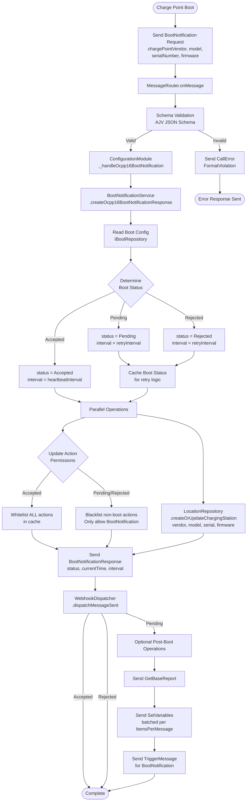
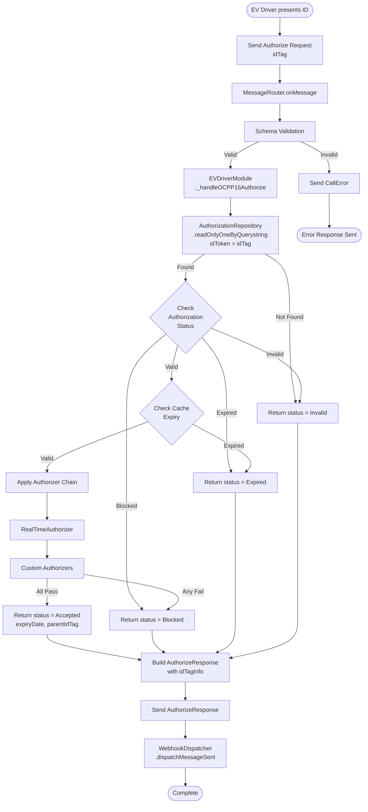
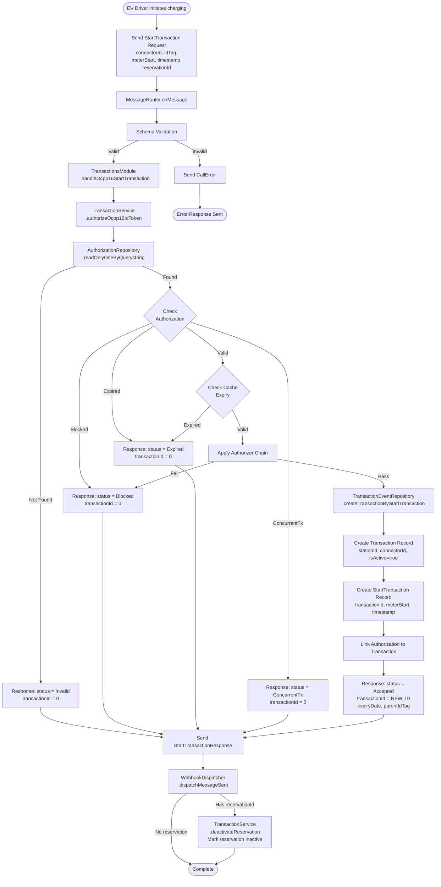
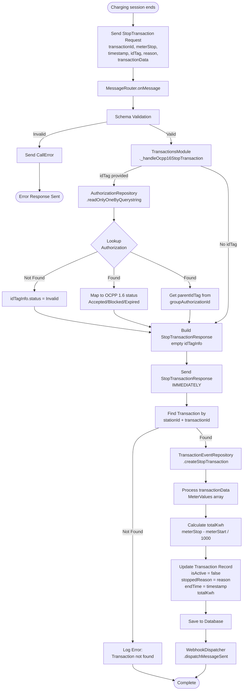
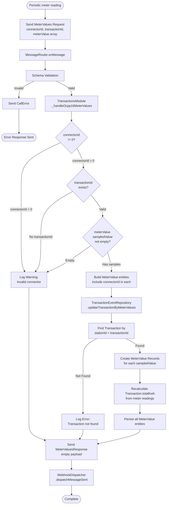
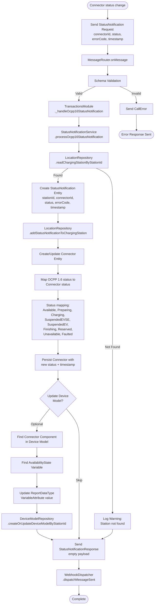
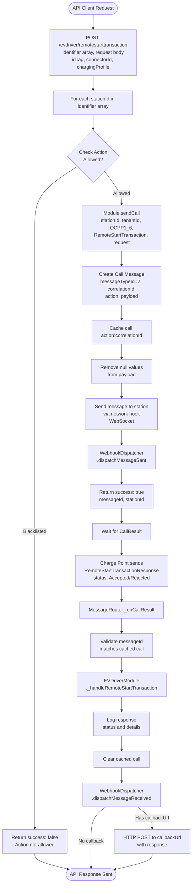
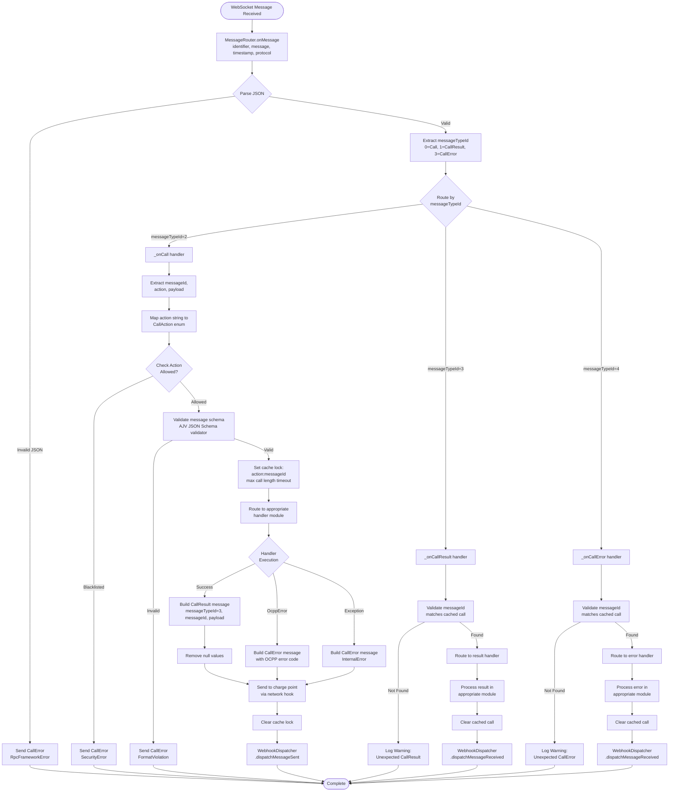

# OCPP 1.6 Charge Point Operation Flow Diagrams

This document contains detailed flow diagrams for all major OCPP 1.6 charge point operations in CitrineOS.

## Table of Contents
1. [BootNotification Flow](#bootnotification-flow)
2. [Authorize Flow](#authorize-flow)
3. [StartTransaction Flow](#starttransaction-flow)
4. [StopTransaction Flow](#stoptransaction-flow)
5. [MeterValues Flow](#metervalues-flow)
6. [StatusNotification Flow](#statusnotification-flow)
7. [RemoteStartTransaction Flow](#remotestarttransaction-flow)
8. [RemoteStopTransaction Flow](#remotestoptransaction-flow)
9. [Message Routing Flow](#message-routing-flow)

---

## BootNotification Flow

---

## Authorize Flow

---

## StartTransaction Flow

---

## StopTransaction Flow

---

## MeterValues Flow

---

## StatusNotification Flow

---

## RemoteStartTransaction Flow

---

## RemoteStopTransaction Flow

---

## Message Routing Flow

This is the central flow that all messages go through.

---

## Key Components

### Repositories Used in OCPP 1.6
- **IBootRepository**: Boot configuration and status
- **ILocationRepository**: Charging stations, connectors, locations
- **IAuthorizationRepository**: ID tokens and authorization data
- **ITransactionEventRepository**: Transactions, meter values, events
- **IDeviceModelRepository**: Device model state (limited in 1.6)
- **IReservationRepository**: Reservations
- **ICache**: In-memory state management

### Services
- **BootNotificationService**: Boot logic orchestration
- **TransactionService**: Transaction lifecycle management
- **StatusNotificationService**: Status update persistence
- **CostCalculator**: Cost computation
- **CostNotifier**: Cost notification scheduling

### Error Codes
- **FormatViolation**: Invalid message format or schema
- **SecurityError**: Action not allowed (blacklisted)
- **InternalError**: Unhandled exception
- **NotSupported**: Action not implemented
- **RpcFrameworkError**: RPC protocol violation

---

## Notes

1. **Cache Strategy**: Action blacklisting prevents operations when boot status is Pending/Rejected
2. **Async Processing**: Webhooks are dispatched asynchronously (fire and forget)
3. **Concurrent Transaction Control**: Authorizer checks prevent concurrent transactions per ID token
4. **Meter Data**: Calculated in Wh (watt-hours) and converted to kWh for totals
5. **Response Timing**: Most responses sent before database persistence for fast response times
6. **Error Handling**: Non-critical errors logged but don't block processing flow
