# OCPP 2.0.1 Charge Point Operation Flow Diagrams

This document contains detailed flow diagrams for all major OCPP 2.0.1 charge point operations in CitrineOS.

## Table of Contents
1. [BootNotification Flow](#bootnotification-flow)
2. [Authorize Flow](#authorize-flow)
3. [TransactionEvent Flow (Started)](#transactionevent-flow-started)
4. [TransactionEvent Flow (Updated)](#transactionevent-flow-updated)
5. [TransactionEvent Flow (Ended)](#transactionevent-flow-ended)
6. [MeterValues Flow](#metervalues-flow)
7. [StatusNotification Flow](#statusnotification-flow)
8. [RequestStartTransaction Flow](#requeststarttransaction-flow)
9. [RequestStopTransaction Flow](#requeststoptransaction-flow)
10. [NotifyEvent Flow](#notifyevent-flow)
11. [GetVariables/SetVariables Flow](#getvariablessetvariables-flow)
12. [ReserveNow Flow](#reservenow-flow)
13. [CancelReservation Flow](#cancelreservation-flow)

---

## BootNotification Flow

```mermaid
flowchart TD
    Start([Charge Point Boot]) --> SendBoot[Send BootNotification Request<br/>reason: PowerUp/Reset/...<br/>chargingStation: vendor, model, serial<br/>firmware version]
    SendBoot --> Router[MessageRouter.onMessage]
    Router --> Validate[Schema Validation<br/>AJV JSON Schema]
    Validate -->|Invalid| SendError[Send CallError<br/>FormatViolation]
    Validate -->|Valid| Handler[ConfigurationModule<br/>._handleBootNotification]

    Handler --> CreateResponse[BootNotificationService<br/>.createBootNotificationResponse]
    CreateResponse --> ReadConfig[Read Boot Config<br/>IBootRepository]
    ReadConfig --> DetermineStatus{Determine<br/>Boot Status}

    DetermineStatus -->|Accepted| SetAccepted[status = Accepted<br/>interval = heartbeatInterval]
    DetermineStatus -->|Pending| SetPending[status = Pending<br/>interval = retryInterval]
    DetermineStatus -->|Rejected| SetRejected[status = Rejected<br/>interval = retryInterval]

    SetAccepted --> ParallelOps[Parallel Operations]
    SetPending --> CacheStatus[Cache Boot Status<br/>for retry logic]
    SetRejected --> CacheStatus
    CacheStatus --> ParallelOps

    ParallelOps --> PersistStation[LocationRepository<br/>.createOrUpdateChargingStation<br/>chargingStation data]
    ParallelOps --> UpdatePermissions{Update Action<br/>Permissions}

    UpdatePermissions -->|Accepted| Whitelist[Whitelist ALL actions<br/>in cache]
    UpdatePermissions -->|Pending/Rejected| Blacklist[Blacklist non-boot actions<br/>Allow: BootNotification,<br/>NotifyReport, SecurityEventNotification]

    Whitelist --> SendResponse[Send BootNotificationResponse<br/>status, currentTime, interval,<br/>statusInfo]
    Blacklist --> SendResponse
    PersistStation --> SendResponse

    SendResponse --> DispatchWebhook[WebhookDispatcher<br/>.dispatchMessageSent]
    DispatchWebhook -->|Pending| PostBootOps[Post-Boot Configuration Sequence]
    DispatchWebhook -->|Accepted| End([Complete])
    DispatchWebhook -->|Rejected| End

    PostBootOps --> GetBaseReport[Send GetBaseReport<br/>requestId, reportBase]
    GetBaseReport --> WaitReport[Wait for NotifyReport messages]
    WaitReport --> ProcessReports[Process Device Model Reports]
    ProcessReports --> ConfigureDeviceModel{Configure<br/>Device Model?}

    ConfigureDeviceModel -->|Yes| BatchSetVars[Batch SetVariables Requests<br/>per ItemsPerMessageSetVariables]
    BatchSetVars --> SendSetVars[Send SetVariables<br/>sequentially or parallel]
    SendSetVars --> WaitSetResult[Wait for SetVariablesResponse]
    WaitSetResult --> CheckReboot{Reboot<br/>Required?}

    CheckReboot -->|Yes| SendReset[Send Reset<br/>type: Immediate/OnIdle]
    CheckReboot -->|No| TriggerBoot[Send TriggerMessage<br/>requestedMessage: BootNotification]
    SendReset --> End
    TriggerBoot --> End

    ConfigureDeviceModel -->|No| TriggerBoot

    SendError --> EndError([Error Response Sent])
```

---

## Authorize Flow

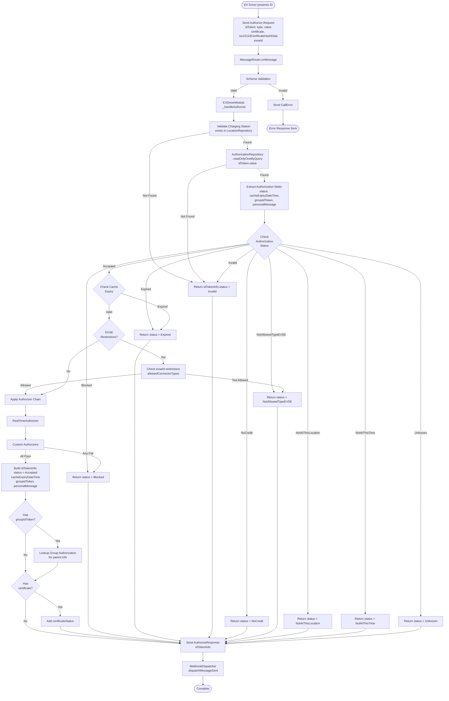

---

## TransactionEvent Flow (Started)

```mermaid
flowchart TD
    Start([Transaction Start Event]) --> SendEvent[Send TransactionEvent Request<br/>eventType: Started<br/>timestamp, triggerReason<br/>seqNo, transactionInfo<br/>idToken, evse, meterValue]
    SendEvent --> Router[MessageRouter.onMessage]
    Router --> Validate[Schema Validation]
    Validate -->|Invalid| SendError[Send CallError]
    Validate -->|Valid| Handler[TransactionsModule<br/>._handleTransactionEvent]

    Handler --> CheckEventType{eventType?}
    CheckEventType -->|Started| ProcessStarted[Process Transaction Start]

    ProcessStarted --> AuthorizeToken[TransactionService<br/>.authorizeIdToken]
    AuthorizeToken --> LookupAuth[AuthorizationRepository<br/>.readOnlyOneByQuery]
    LookupAuth -->|Not Found| SetInvalid[idTokenInfo.status = Invalid]
    LookupAuth -->|Found| CheckAuth{Check<br/>Authorization}

    CheckAuth -->|Not Accepted| SetAuthStatus[Set appropriate status:<br/>Blocked, Expired, etc.]
    CheckAuth -->|Accepted| CheckExpiry{Check Cache<br/>Expiry}

    CheckExpiry -->|Expired| SetAuthStatus
    CheckExpiry -->|Valid| ApplyAuthorizers[Apply Authorizer Chain]
    ApplyAuthorizers -->|Fail| SetAuthStatus
    ApplyAuthorizers -->|Pass| SetAccepted[idTokenInfo.status = Accepted]

    SetAccepted --> CreateTransaction[TransactionEventRepository<br/>.createTransactionByTransactionEvent]
    CreateTransaction --> CreateTxRecord[Create Transaction Record<br/>stationId, transactionId<br/>isActive = true<br/>chargingState = EVConnected]

    CreateTxRecord --> CreateEventRecord[Create TransactionEvent Record<br/>eventType = Started<br/>timestamp, triggerReason<br/>seqNo]
    CreateEventRecord --> LinkComponents[Link Components:<br/>- idToken → Authorization<br/>- evse → EVSE<br/>- meterValue → MeterValue]

    LinkComponents --> ProcessReservation{Has<br/>reservationId?}
    ProcessReservation -->|Yes| FindReservation[Find Reservation by ID]
    FindReservation --> LinkReservation[Link Transaction to Reservation]
    LinkReservation --> DeactivateRes[Deactivate Reservation]
    DeactivateRes --> ProcessMeterValues
    ProcessReservation -->|No| ProcessMeterValues

    ProcessMeterValues --> ParseMeterValues[Parse meterValue array<br/>Extract sampledValues]
    ParseMeterValues --> CreateMeterRecords[Create MeterValue Records<br/>Associate with Transaction]
    CreateMeterRecords --> SendResponse[Send TransactionEventResponse<br/>idTokenInfo, updatedPersonalMessage]

    SetInvalid --> SendResponse
    SetAuthStatus --> SendResponse

    SendResponse --> DispatchWebhook[WebhookDispatcher<br/>.dispatchMessageSent]
    DispatchWebhook --> PostProcess{Post-Processing}

    PostProcess --> CalculateCost[CostCalculator<br/>.calculateCostAndSendUpdate]
    CalculateCost --> CheckTariff{Has Tariff?}
    CheckTariff -->|Yes| ComputeCost[Compute running cost<br/>based on meter values]
    CheckTariff -->|No| End([Complete])
    ComputeCost --> ScheduleNotify[CostNotifier<br/>.scheduleNotification<br/>based on costUpdate settings]
    ScheduleNotify --> End

    SendError --> EndError([Error Response Sent])
```

---

## TransactionEvent Flow (Updated)

```mermaid
flowchart TD
    Start([Transaction Update Event]) --> SendEvent[Send TransactionEvent Request<br/>eventType: Updated<br/>timestamp, triggerReason<br/>seqNo, transactionInfo<br/>meterValue, chargingState]
    SendEvent --> Router[MessageRouter.onMessage]
    Router --> Validate[Schema Validation]
    Validate -->|Invalid| SendError[Send CallError]
    Validate -->|Valid| Handler[TransactionsModule<br/>._handleTransactionEvent]

    Handler --> CheckEventType{eventType?}
    CheckEventType -->|Updated| ProcessUpdated[Process Transaction Update]

    ProcessUpdated --> FindTransaction[TransactionEventRepository<br/>.findTransactionByStationIdAndTransactionId]
    FindTransaction -->|Not Found| LogError[Log Error:<br/>Transaction not found]
    FindTransaction -->|Found| CreateEventRecord[Create TransactionEvent Record<br/>eventType = Updated<br/>timestamp, triggerReason<br/>seqNo]

    CreateEventRecord --> UpdateTransaction[Update Transaction Fields:<br/>- chargingState<br/>- remoteStartId<br/>- stoppedReason]
    UpdateTransaction --> ProcessMeterValues{Has<br/>meterValue?}

    ProcessMeterValues -->|Yes| ParseMeterValues[Parse meterValue array<br/>Extract sampledValues]
    ParseMeterValues --> CreateMeterRecords[Create MeterValue Records]
    CreateMeterRecords --> RecalcKwh[Recalculate totalKwh<br/>from all meter values]
    RecalcKwh --> SendResponse[Send TransactionEventResponse<br/>totalCost, chargingPriority]

    ProcessMeterValues -->|No| SendResponse
    LogError --> SendResponse

    SendResponse --> DispatchWebhook[WebhookDispatcher<br/>.dispatchMessageSent]
    DispatchWebhook --> PostProcess{Post-Processing}

    PostProcess --> CalculateCost[CostCalculator<br/>.calculateCostAndSendUpdate]
    CalculateCost --> CheckTariff{Has Tariff?}
    CheckTariff -->|Yes| ComputeCost[Compute updated cost<br/>based on latest meter values]
    CheckTariff -->|No| End([Complete])
    ComputeCost --> CheckDelta{Cost change<br/>> threshold?}
    CheckDelta -->|Yes| SendCostUpdate[Send CostUpdated message<br/>to Charge Point]
    CheckDelta -->|No| ScheduleNotify[Schedule next cost check<br/>based on costUpdate settings]
    SendCostUpdate --> ScheduleNotify
    ScheduleNotify --> End

    SendError --> EndError([Error Response Sent])
```

---

## TransactionEvent Flow (Ended)

```mermaid
flowchart TD
    Start([Transaction End Event]) --> SendEvent[Send TransactionEvent Request<br/>eventType: Ended<br/>timestamp, triggerReason<br/>seqNo, transactionInfo<br/>meterValue, stoppedReason]
    SendEvent --> Router[MessageRouter.onMessage]
    Router --> Validate[Schema Validation]
    Validate -->|Invalid| SendError[Send CallError]
    Validate -->|Valid| Handler[TransactionsModule<br/>._handleTransactionEvent]

    Handler --> CheckEventType{eventType?}
    CheckEventType -->|Ended| ProcessEnded[Process Transaction End]

    ProcessEnded --> FindTransaction[TransactionEventRepository<br/>.findTransactionByStationIdAndTransactionId]
    FindTransaction -->|Not Found| LogError[Log Error:<br/>Transaction not found]
    FindTransaction -->|Found| CreateEventRecord[Create TransactionEvent Record<br/>eventType = Ended<br/>timestamp, triggerReason<br/>seqNo, stoppedReason]

    CreateEventRecord --> ProcessMeterValues{Has<br/>meterValue?}
    ProcessMeterValues -->|Yes| ParseMeterValues[Parse meterValue array<br/>Extract final meter readings]
    ParseMeterValues --> CreateMeterRecords[Create MeterValue Records]
    CreateMeterRecords --> CalcFinalKwh[Calculate final totalKwh<br/>from all meter values]
    CalcFinalKwh --> UpdateTransaction
    ProcessMeterValues -->|No| UpdateTransaction

    UpdateTransaction --> SetInactive[Update Transaction:<br/>- isActive = false<br/>- stoppedReason<br/>- endTime = timestamp<br/>- chargingState = Idle<br/>- totalKwh]

    SetInactive --> SendResponse[Send TransactionEventResponse<br/>totalCost, idTokenInfo]
    SendResponse --> DispatchWebhook[WebhookDispatcher<br/>.dispatchMessageSent]
    DispatchWebhook --> PostProcess{Post-Processing}

    PostProcess --> CalculateFinalCost[CostCalculator<br/>.calculateFinalCost]
    CalculateFinalCost --> CheckTariff{Has Tariff?}
    CheckTariff -->|Yes| ComputeFinalCost[Compute final transaction cost<br/>based on all meter values]
    CheckTariff -->|No| End([Complete])
    ComputeFinalCost --> SendFinalCost[Send CostUpdated message<br/>with final cost]
    SendFinalCost --> End

    LogError --> SendResponse

    SendError --> EndError([Error Response Sent])
```

---

## MeterValues Flow

```mermaid
flowchart TD
    Start([Periodic meter reading]) --> SendMeter[Send MeterValues Request<br/>evseId, meterValue array<br/>sampledValue with measurand,<br/>phase, location, unit, value]
    SendMeter --> Router[MessageRouter.onMessage]
    Router --> Validate[Schema Validation]
    Validate -->|Invalid| SendError[Send CallError]
    Validate -->|Valid| Handler[TransactionsModule<br/>._handleMeterValues]

    Handler --> ValidateEvse{evseId<br/>exists?}
    ValidateEvse -->|No| LogWarning[Log Warning:<br/>Invalid EVSE]
    ValidateEvse -->|Yes| FindTransaction[TransactionEventRepository<br/>.findActiveTransactionByEvseId]

    FindTransaction -->|Not Found| LogNoTx[Log Warning:<br/>No active transaction]
    FindTransaction -->|Found| ValidateSamples{meterValue.<br/>sampledValue<br/>not empty?}

    ValidateSamples -->|Empty| LogWarning
    ValidateSamples -->|Has samples| BuildMeterValues[Build MeterValue entities<br/>Include evseId, timestamp]

    BuildMeterValues --> UpdateTransaction[TransactionEventRepository<br/>.updateTransactionByMeterValues]
    UpdateTransaction --> CreateRecords[Create MeterValue Records<br/>for each sampledValue]

    CreateRecords --> ParseSampledValue[Parse each sampledValue:<br/>- measurand: Energy.Active.Import.Register<br/>- phase: L1/L2/L3<br/>- location: Outlet/Inlet<br/>- unit: Wh/kWh/W/A/V<br/>- value, context, format]

    ParseSampledValue --> RecalcKwh[Recalculate Transaction.totalKwh<br/>from Energy.Active.Import.Register<br/>meter readings]
    RecalcKwh --> PersistValues[Persist all MeterValue entities]
    PersistValues --> SendResponse[Send MeterValuesResponse<br/>empty payload]

    LogWarning --> SendResponse
    LogNoTx --> SendResponse

    SendResponse --> DispatchWebhook[WebhookDispatcher<br/>.dispatchMessageSent]
    DispatchWebhook --> PostProcess{Post-Processing}

    PostProcess --> CalculateCost[CostCalculator<br/>.calculateCostAndSendUpdate]
    CalculateCost --> CheckTariff{Has Tariff?}
    CheckTariff -->|Yes| ComputeCost[Compute cost update<br/>based on new meter values]
    CheckTariff -->|No| End([Complete])
    ComputeCost --> CheckDelta{Cost change<br/>> threshold?}
    CheckDelta -->|Yes| SendCostUpdate[Send CostUpdated message]
    CheckDelta -->|No| End
    SendCostUpdate --> End

    SendError --> EndError([Error Response Sent])
```

---

## StatusNotification Flow

```mermaid
flowchart TD
    Start([Connector status change]) --> SendStatus[Send StatusNotification Request<br/>timestamp, connectorStatus<br/>evseId, connectorId]
    SendStatus --> Router[MessageRouter.onMessage]
    Router --> Validate[Schema Validation]
    Validate -->|Invalid| SendError[Send CallError]
    Validate -->|Valid| Handler[TransactionsModule<br/>._handleStatusNotification]

    Handler --> Process[StatusNotificationService<br/>.processStatusNotification]
    Process --> ValidateStation[LocationRepository<br/>.readChargingStationByStationId]
    ValidateStation -->|Not Found| LogWarning[Log Warning:<br/>Station not found]
    ValidateStation -->|Found| CreateNotification[Create StatusNotification Entity<br/>stationId, timestamp<br/>connectorStatus, evseId, connectorId]

    CreateNotification --> PersistNotification[LocationRepository<br/>.addStatusNotificationToChargingStation]
    PersistNotification --> FindEvse{Find EVSE<br/>Entity}

    FindEvse -->|Not Found| CreateEvse[Create EVSE Entity<br/>evseId for station]
    FindEvse -->|Found| FindConnector{Find Connector<br/>Entity}
    CreateEvse --> FindConnector

    FindConnector -->|Not Found| CreateConnector[Create Connector Entity<br/>connectorId for EVSE]
    FindConnector -->|Found| UpdateConnector[Update Connector Entity]
    CreateConnector --> MapStatus[Map connectorStatus:<br/>Available, Occupied, Reserved,<br/>Unavailable, Faulted]

    UpdateConnector --> MapStatus
    MapStatus --> SetConnectorStatus[Set Connector.connectorStatus<br/>Set timestamp]
    SetConnectorStatus --> PersistConnector[Persist Connector changes]

    PersistConnector --> UpdateDeviceModel{Update Device<br/>Model?}
    UpdateDeviceModel -->|Yes| FindComponent[Find EVSE/Connector Component<br/>in Device Model]
    FindComponent --> FindVariable[Find AvailabilityState Variable<br/>or ConnectorStatus Variable]
    FindVariable --> UpdateVariable[Update VariableAttribute value<br/>with new status]
    UpdateVariable --> CallDeviceModel[DeviceModelRepository<br/>.createOrUpdateDeviceModelByStationId]

    CallDeviceModel --> SendResponse[Send StatusNotificationResponse<br/>empty payload]
    UpdateDeviceModel -->|No| SendResponse
    LogWarning --> SendResponse

    SendResponse --> DispatchWebhook[WebhookDispatcher<br/>.dispatchMessageSent]
    DispatchWebhook --> End([Complete])

    SendError --> EndError([Error Response Sent])
```

---

## RequestStartTransaction Flow

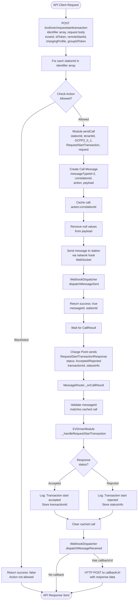

---

## RequestStopTransaction Flow

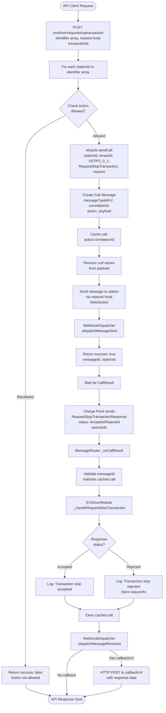

---

## NotifyEvent Flow

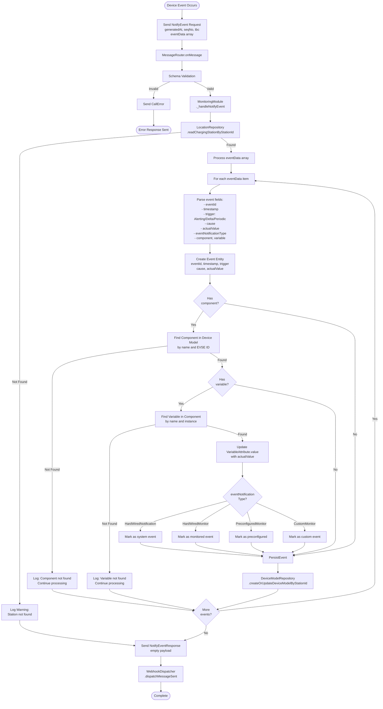

---

## GetVariables/SetVariables Flow

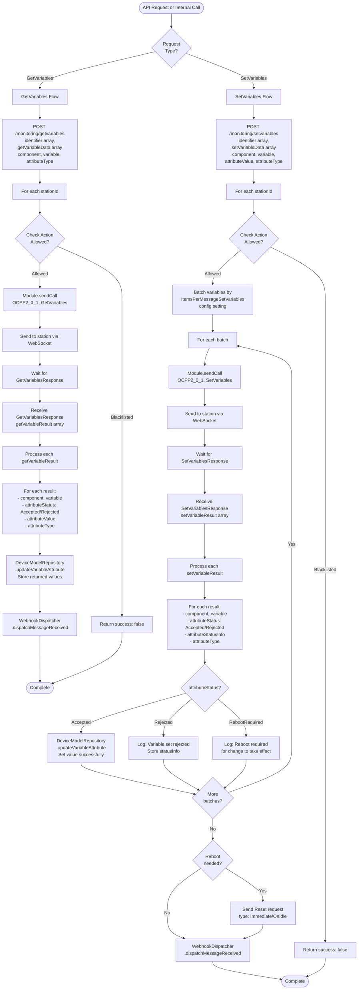

---

## ReserveNow Flow

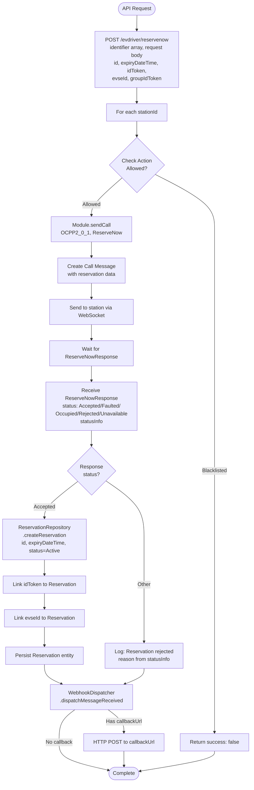

---

## CancelReservation Flow

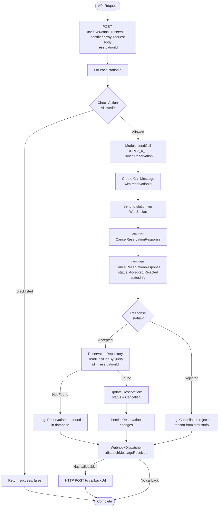

---

## Key Components and Differences from OCPP 1.6

### Major Architectural Changes

1. **Unified Transaction Event**:
   - OCPP 1.6: Separate StartTransaction/StopTransaction messages
   - OCPP 2.0.1: Single TransactionEvent with eventType: Started/Updated/Ended

2. **Device Model**:
   - OCPP 1.6: Simple configuration key-value pairs
   - OCPP 2.0.1: Rich Component → Variable → Attribute hierarchy

3. **ID Token Types**:
   - OCPP 1.6: Simple idTag string
   - OCPP 2.0.1: Complex idToken object with type (ISO14443, ISO15693, KeyCode, etc.)

4. **EVSE Structure**:
   - OCPP 1.6: Flat connector structure
   - OCPP 2.0.1: EVSE → Connector hierarchy (one EVSE can have multiple connectors)

5. **Event System**:
   - OCPP 1.6: Limited to specific notification messages
   - OCPP 2.0.1: Rich NotifyEvent system with device model integration

6. **Charging Profiles**:
   - OCPP 1.6: Basic charging profile support
   - OCPP 2.0.1: Advanced smart charging with EV charging needs, schedules, and limits

7. **Authorization**:
   - OCPP 1.6: Simple Accepted/Blocked/Expired/Invalid
   - OCPP 2.0.1: Extended statuses (NoCredit, NotAllowedTypeEVSE, NotAtThisLocation, NotAtThisTime, etc.)

### Repositories Used in OCPP 2.0.1

- **IBootRepository**: Boot configuration
- **ILocationRepository**: Charging stations, EVSEs, connectors
- **IAuthorizationRepository**: ID tokens with extended authorization data
- **ITransactionEventRepository**: Transactions and transaction events
- **IDeviceModelRepository**: Complete device model (components, variables, attributes)
- **IReservationRepository**: Reservations with status tracking
- **ICache**: Action permissions and boot status

### Services

- **BootNotificationService**: Boot and configuration orchestration
- **TransactionService**: Transaction lifecycle with integrated authorization
- **StatusNotificationService**: Status updates with device model sync
- **CostCalculator**: Real-time cost calculation based on tariffs
- **CostNotifier**: Scheduled cost update notifications

### Key Implementation Features

1. **Cost Calculation**: Integrated cost calculation during transactions with configurable update intervals
2. **Device Model Sync**: Automatic device model updates from events and status notifications
3. **Batching**: SetVariables operations batched per ItemsPerMessageSetVariables setting
4. **Reservation Linking**: Reservations linked to transactions when started
5. **Group Tokens**: Support for parent/group authorization tokens
6. **Certificate Support**: ISO 15118 certificate management integrated into authorization
7. **Rich Status Info**: Detailed statusInfo objects for better error diagnostics

---

## Notes

1. **Async Webhooks**: All operations dispatch webhooks asynchronously
2. **Cache Strategy**: Boot status and action permissions cached for performance
3. **Non-Blocking**: Parser errors logged but don't abort processing
4. **Cost Updates**: Configurable cost update frequency and thresholds
5. **Device Model**: Variables updated from multiple sources (NotifyEvent, StatusNotification, GetVariables)
6. **Reboot Handling**: Automatic reboot triggering when SetVariables requires it
7. **Batch Processing**: Large device model configurations processed in batches
